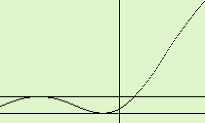
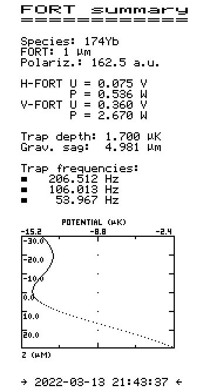
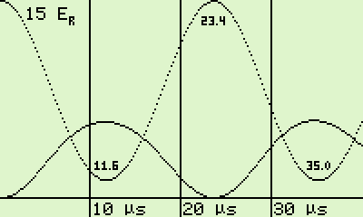
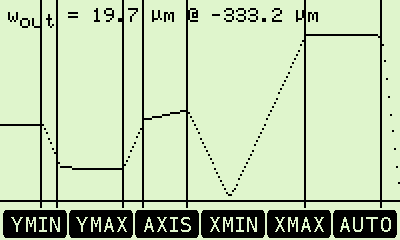

# DM42 Programs

This is a my personal collection of programs for the [SwissMicros
DM42](https://www.swissmicros.com/product/dm42) pocket calculator which is
based on the excellent [Free42](https://github.com/thomasokken/free42)
simulator by Thomas Okken of the classic HP-42S calculator by Hewlett Packard.

Most of the programs are related to the requirements in atomic physics
experiments but there is also some electronics and further completely
unrelated stuff around.

Even though the programs should be mostly compatible with the original HP-42S
they do make use of some of the convenience functions offered by Free42 and
for graphical output the advanced capabilities of the DM42 platform are also
partially relied on.

## Short introduction to the individual programs

In the following we will quickly present each of the programs in the present
collection.

### B-F: Lithium level splitting from Breit-Wigner formula

This program calculates the energy difference `f/MHz` (in MHz) between the two
lowest hyperfine Zeeman levels, often denoted |1> and |2>, of Lithium-6 given
the applied magnetic field `B/G` (in Gauss) using the Breit-Wigner formula. It
is intended for use with the Solver application so it can also be used to
convert a frequency difference back into a magnetic field.

### BTOOL: Gaussian beam tools

This is a collection of currently three programs for often needed calculations
with Gaussian beams selected by a menu system. `Imax` calculates the peak
intensity given the beam power and the waist size, and the Rayleigh length is
calculated by `zR` given waist and wavelength. Finally `Focus` is intended to
calculate the beam waist of a Gaussian beam that is focused by a lens.
Parameters are the `WAIST` size and its position `Z0` of the incident beam, its
wavelength `LAMBDA` and the focal length `F` of the lens.

### CPCTR: Conversion between capacitor values and codes

This is a simple converter program for capacitor values. It converts between
the nominal capacitance and the code number often printed on small capacitor
packages. Either enter the capacity (in Farad, e.g. 1ᴇ-7) and push `→CODE` or
give the code (e.g. 104) and push `→VAL` for the conversion.

### CMag: Magnetic coil set value to field conversion

This tool helps to quickly convert between setpoint voltages and the actual
magnetic fields created by three mutually orthogonal Helmholtz coil pairs. It
is intended for use from within the Solver application. The axis is chosen by
putting 1, 2 or 3 into `Axis`. Then, one starts by either giving the `CMag/V`
voltage or the `B/G` field and solves for the unknown. Internally each axis is
parameterized by a first order polynomial with the parameters `ofst` and
`scale` as local variables. Units are 'V' for `ofst` and 'V/(100 mG)' for
`scale`.

### CONST: Collection of physical constants

Based on CODATA 2018 this program is a collection of physical constants
probably most useful for work in the field of atom-optics. It is implemented
using the Free42 'FUNC' command to leave the stack unchanged and also includes
some additional information on each constant (name and unit) in the ALPHA
register which gets displayed.

### DB: Various power conversions from and to dBm

This small tool converts between power in `dBm`, `mW`, `Vpp` (peak-to-peak
voltage) and `Vrms` (root-mean-square voltage). Enter the known numeric value
and the softkey corresponding to the initial unit. Then press the softkey of
the target unit and the converted value will be shown.

### E_b: Estimate binding energy of two-species Feshbach molecules

This program is intended for use with the Solver application and converts
between molecular binding energy `E/Hz` and effective scattering length
`a/a0`, given the masses (in amu) of the two atomic species involved.

### FORT: Calculate trap parameters of a crossed beam optical trap

This collection of eight programs is to calculate the potential created by a
pair laser beams forming a crossed FORT (far-off-resonance trap). The program
is here presented in the files
[FORT_structure_overview.hp42s](FORT_structure_overview.hp42s), giving only an
annotated overview of the programs and sub-labels, and
[FORT_with_subprograms.hp42s](FORT_with_subprograms.hp42s) which contains the
detailed listings of all programs. Please look at both files for the details
of the included programs and their individual inner workings.

The main frontend program is FORT. In the menu one defines the control voltages
`H-VLT` and `V-VLT` of the horizontal and vertical FORT lasers. These are
internally converted into laser powers. With these basic settings use `CALC` to
calculate the trap position, its frequencies and depth. The results are
accessed via `G SAG` (the gravitational sag atoms experience in the trap) and
`FREQ` (a summary of the three trapping frequencies). Use `PLOT` to plot a
vertical cut through the center of the trap on the display of the DM42. The
vertical zero position, the trap minimum and its maximum are indicated by
vertical and horizontal lines, respectively. On the second page of the menu the
atomic species can be selected (168Er, 174Yb, 7Li, 6Li) and the type of
trapping lasers (either `1 µm` is active for a crossed FORT at 1064 and 1060
nm, or it is not selected and a FORT operating at 1550 nm is assumed) can be
selected. 

Finally, with `PRNT` a complete summary of the laser setup, the trap geometry
and a plot of the trap potential is printed to an IR printer such as the HP
82240A.

Plotting relies on the excellent `DISPLAY` program originally presented by
Bill in the [SwissMicros
forum](https://forum.swissmicros.com/viewtopic.php?f=19&t=446). This routine
is used for adding string output to the graphics output of the DM42. I here
use a slightly modified version of this program by encapsulating everything in
a 'FUNC 00' call to prevent any changes of the stack by the execution of
DISPLAY.

### FPLOT: Function plotter for an IR printer with tic marks and labels

This program is based on the original HP-42S Owner´s manual PLOT routine. It
is here expanded to also print out a frame around the plot with tic marks and
labels. The program itself is not ready for use as-is. Rather, it served to
develop the printing routines of the FORT program.

### FRQCNV: Convert laser frequencies to wavelengths to energies and more

This program is for converting wavelengths, etc., between the wavelenth in
`nm`, the frequency in `THz`, the wavenumber in `1/cm`, oscillation period in
`fs`, and the photon energy in `eV` and in `J`. Enter the known numeric value
and the softkey corresponding to the initial unit. Then press the softkey of
the target unit and the converted value will be shown.

### HLi6: Lithium level splitting by diagonalization of the Hamiltonian

This program serves the same purpose as 'B-F'. It calculates the energy
difference (in MHz) between the two lowest hyperfine Zeeman levels, often
denoted |1> and |2>, of Lithium-6 given the applied magnetic field (in Gauss).
However, instead of using the Breit-Wigner formula it starts by formulating
the Lithium ground state Hamiltonian which is then diagonalized and the
difference of the two lowest eigenvalues gives the splitting energy.

The result is numerically equivalent to the Breit-Wigner expression. It is,
however, much more computationally intensive, needs more time and memory but
it was also a fun programming exercise. Internally the TRED2 and TQLI routines
of 'Numerical Recipes' are used to do the heavy lifting.

### LATTICE: Calculation of lattice Raman-Nath interference patterns

One method of calibrating the depth of an optical lattice in ultracold atom
experiments is to use very short lattice pulses and to observe the
interference pattern of a Bose-Einstein condensate after release from the
trap. In particular minima and maxima of the oscillation pattern as function
of either lattice beam intensity or pulse duration can be compared to
numerical calculations to determine the lattice depths. The program internally
assumes a lattice laser wavelenth of 532 nm (set in REG 01) and a mass of 174
amu (REG 02). The lattice depth (in units of the recoil energy) is set via the
`s` menu and the pulse duration (in µs) via `t`. To change those values, press
the corresponding softkey, enter the new value and confirm by pressing R/S.
Then, by pressing `CALC` the fractional population of the zero momentum ('k =
0') peak is calculated and displayed. Finally, with `PLOT` the DM42 plots for
the specified lattice depth `s` the development of the k = 0 and the |k| = 1
order peaks as function of the pulse duration. The minima and maxima of the k = 0
curve are labeled with their respective pulse durations. Press R/S to return
to the main menu.

Plotting relies on the excellent `DISPLAY` program originally presented by
Bill in the [SwissMicros
forum](https://forum.swissmicros.com/viewtopic.php?f=19&t=446). This routine
is used for adding string output to the graphics output of the DM42. I here
use a slightly modified version of this program by encapsulating everything in
a 'FUNC 00' call to prevent any changes of the stack by the execution of
DISPLAY.

### NTH: Central density of a thermal gas

This simple program calculates the central density of a thermal gas in a
harmonic trap. Input parameters are the number of atoms `N`, their temperature
`T` (in K) and the atomic `MASS` in amu. Furthermore the trap frequencies (in
Hz) are expected to be stored in the 3x1 matrix `TRAPF`. The menu is
implemented as a standard VARMENU and the calculation is started by pressing
R/S.

### OHM: Convert resistor color codes to their numerical values

This small tool converts from the color code of a resistor to its numerical
resistance value. Just key in the colors one-by-one with the softkeys (use up
and down to access all colors) and observe how the resister value slowly
builds up.

### PLOT: Original HP42S function plotter for use with IR printer

This is the stock plotting program from chapter 10 of the HP-42S Owner´s
manual for use with, e.g., an HP 82240A printer.

### PREFIX: Beautify numerical outputs by proper use of prefix letters

Seeing physical values with unnecessarily large or small exponents is prone to
errors in the interpretation, therefore we usually use prefixes such as 'k',
'M', or 'µ'. The PREFIX program (implented as 'FUNC 00' to keep the stack in
order) looks at the value in ST X, determines the most appropriate prefix, and
adds the properly formatted number and its prefix character to the ALPHA
register.

### PROPAG: Propagate a Gaussian laser bean through an optics system

This package consists of three programs, the beam propagator BPROP, the cavity
mode calculator CAVITY and the beam size plotter BPLOT. 

At its heart the non-interactive program BPROB takes the variables `WAIST`,
`Z0` and `LAMBDA` that define incident waist size, position and wavelength of
the Gaussian input beam, and calculated the beam parameters at the final
position `POS`. The beam is propagated through the optical system defined in
the matrix `OSYS`. The final radius is stored in `RF` and the complex output
beam parameter is retained in `QO`. The matrix `OSYS` defined pairs of beam
path elements (DIST, LENS, or MIRROR) and their parameters (distance, focal
length, or radius of curvature). See the end of [PROPAG.hp42s](PROPAG.hp42s)
for some examples.

The beam plotter BPLOT works in close analogy to the original HP-42S DPLOT
program and plots the size of the Gaussian beam as it traverses the optical
system. The positions of the optical elements are indicated by vertical lines.

Finally, the cavity mode calculator CAVITY is for use with the Solver
application and, given an optical system where the output of the last element
can again be considered as the input of the same system, self-consistently
finds the waist of the cavity mode. Note that the waist is assumed to be at
position zero, that is coinciding with the input/output of the system.

### P-WAVE: Calculation of the p-wave threshold energy

This small program calculates the p-wave threshold energy (expressed as a
temperature in µK) for collisions between atoms with masses `M1` and `M2`
(both in amu) and with a provided `C6` coefficient. The menu system is a
standard VARMENU.

### R2T: Conversion between NTC resistance and actual temperature

This set of two programs is to convert between the resistance of a typical 10
kΩ NTC thermistor and the actual temperature. The program R2T does the actual
conversion between the resistance in ST X and the temperature in °C returned
on the stack. The second program, T←→R, is a convenient frontend for use with
the Solver application to quickly go back and forth between resistances and
temperatures.

In the current version the NTC is assumed to be of type EC95F and the
conversion is parameterized for the range 0 to 50°C as a third order
polynomial.

### TQLI: Numerical recipes TQLI routine to diagonalize symmetric tridiagonal matrices

This is an implementation of the TQLI routine of Numerical recipes for the
DM42. It is required for the HLi6 program.

### TRED2: Numerical recipes TRED2 routine to reduce symmetric matrix to tridiagonal one

This is an implementation of the TRED2 routine of Numerical recipes for the
DM42. It is required for the HLi6 program.

### V60: Helps you through your favorite V60 coffee brewing routine

After so much physics and math a good cup of coffee is in order, preferably
made as a V60 drip coffee. But do you always remember the proper water
quantities and timings for the perfect cup? No? Fear not as now your DM42 (or
Free42 on your phone where it admittedly looks better) can give you a hand in
maintaining the perfect timing for all your pours. Everything starts by a
recipe which is stored in the matrix `V60R` it defines the names and the times
(in H.MMSS format) for each step. It provides the total elapsed time and the
time till the next step. There is even a previous of the upcoming step so that
you can better prep yourself.

My favorite method is the 4-6 method by Tetsu Kasuya. Find the recipe at the
end of the [V60.hp42s](V60.hp42s), use it as-is or take it as a base for your
own approach.

And now, enjoy your coffee.

## Contact

For any comments and/or bug reports please report to the author,
schaefer@scphys.kyoto-u.ac.jp.
